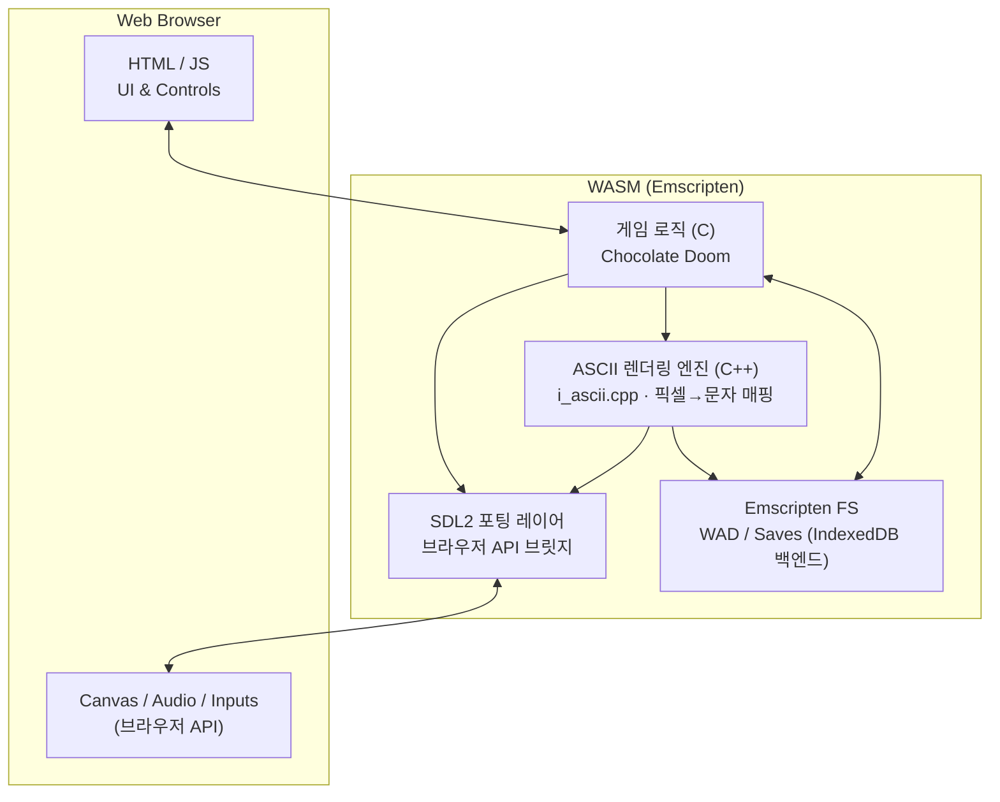

# ASCII Doom

[](https://github.com/devMinseok/ascii-doom/actions/workflows/deploy.yml)

Doom 게임을 웹에서 ASCII 아트로 즐길 수 있습니다.


## 🗂️ 프로젝트 정리

1. 팀 소개
   - 팀명: FC온라인
   - 팀장: 👑김철준   
   - 팀원: 강민석, 김문선

2. 프로젝트 개요 및 주요 기능  
   - Doom 렌더링을 ASCII 아트로 변환해 브라우저에서 플레이.  
   - 주요 기능: WebAssembly 기반 실행, SDL2 입출력 브릿지, 실시간 픽셀→ASCII 변환, WAD 로드 및 캐시, 키보드 입력 처리.

3. 실행 및 플레이 방법

   ⌨️ 조작키
   | 동작 | 키 |
   |------|-----|
   | 이동 | 방향키 (↑↓←→) |
   | 공격 | `A` |
   | 상호작용 | `S` |

    - 로컬 실행: [🔨 Build](#-build) 섹션 참고
    - GitHub Pages: https://devMinseok.github.io/ascii-doom/

4. 역할 분담  
   - 강민석: 전체 구조 설계  
   - 김문선: UI 설계  
   - 김철준: 아스키 그래픽 변환 로직 설계

5. 개발 중 어려웠던 점과 해결 방법  
      - WASM 포팅 & SDL 렌더링 흐름 파악  
        - Doom이 `screens[]` 프레임버퍼를 SDL로 넘기고, Emscripten이 이를 `<canvas>`에 매핑하는 전 과정을 따라가야 원시 RGBA 데이터를 확보할 수 있었다.  
        - JS에서 WebAssembly 메모리를 읽을 때 heap view가 언제 무효화되는지까지 이해해야 안정적으로 훅을 걸 수 있어, SDL 경로와 소프트웨어 렌더링 경로를 분리 조사하고 직접 프레임버퍼 hook을 구현했다.  

      - ASCII 변환 파이프라인 설계  
        - 엔진은 320×200 RGBA 프레임을 내보내지만 목표 출력은 240×80 문자 격자로, 매 프레임 `Raw RGBA → 다운샘플 → 셀 평균 → 밝기/문자 결정 → 색상 보정`을 수행해야 했다.  
        - 셀마다 픽셀을 순회하는 방식은 너무 느려서 Summed Area Table(적분영상)과 역수 LUT로 평균을 O(1)에 계산하고, SIMD 가능한 구간에 WASM SIMD128을 적용해 네 셀씩 동시에 밝기를 산출하도록 구조화했다.  
        - 덕분에 “문자 기반 렌더링을 게임 엔진 프레임레이트로 유지하려면?”이라는 숙제를 알고리즘+저수준 최적화 조합으로 풀 수 있었다.  


6. 가산점 항목으로 생각하는 부분
   - **SIMD 최적화 시도**: WASM SIMD128 인트린식을 사용하여 픽셀 처리 파이프라인 병렬화.
      - 성능 향상: C++ Scalar(0.47ms) 대비 소폭의 성능 향상(0.45ms) 확인, JS(0.56ms) 대비 약 20%의 Latency 절감 효과 입증. (7번 테이블 참고)
     - 기술적 구현: 4개의 픽셀(RGBA)을 128비트 벡터로 단일 로드, 밝기 변환 및 클램핑을 병렬 연산하여 처리량 극대화. 또한 16바이트 정렬 메모리를 사용하여 접근 효율 최적화.
   - **순수 JS 엔진 구현 및 비교**: WASM/SIMD의 성능 우위를 검증하기 위해 동일한 알고리즘을 JavaScript로 직접 구현하여 비교.  
     - 성능 비교: C++(SIMD On)이 JS 대비 약 20% 더 빠른 처리 속도를 보임. (7번 테이블 참고)
     - WASM이 네이티브에 준하는 성능을 내고 있음을 확인하는 대조군으로 활용.

7. Latency 측정 테이블  
   > **측정 기준**: RGBA 버퍼 입력 시점부터 ASCII 버퍼 출력 완료 시점까지의 **순수 알고리즘 연산 시간**  
   > - **C++**: `I_ConvertRGBAtoASCII` (적분영상 생성 → 2-Pass 변환(SIMD 최적화 구조))  
   > - **JavaScript**: `convertRGBAtoASCII_JS` (적분영상 생성 → 1-Pass 변환)  
   > - **공통 제외 항목**: LUT 초기화, 메모리 할당 체크, Canvas 렌더링, 브라우저 컴포지팅 등 외적 요소를 배제하여 동일 조건 비교.

   | 시나리오 | FPS | Latency Avg | Latency Min | Latency Max | 환경 |
   |----------|-----|-------------|-------------|-------------|------|
   | C++ SIMD ON  | 35.00 | 0.45 ms | 0.00 ms | 1.20 ms | MacOS / Apple M3 Pro / 36GB RAM / Chrome |
   | C++ SIMD OFF | 34.96 | 0.47 ms | 0.10 ms | 1.40 ms | MacOS / Apple M3 Pro / 36GB RAM / Chrome |
   | JavaScript  | 27.32 | 0.56 ms | 0.40 ms | 1.10 ms | MacOS / Apple M3 Pro / 36GB RAM / Chrome |

## ⚙️ 동작 방식

### 아키텍처



### 빌드 프로세스

```text
C/C++ 소스 코드 (Chocolate Doom)
      ↓
Emscripten 컴파일러 (emcc)
      ↓
WebAssembly (.wasm) + JavaScript (.js) + HTML (.html)
      ↓
브라우저에서 실행
```

1. **소스 코드 컴파일**
   - Chocolate Doom의 C/C++ 소스 코드를 Emscripten으로 컴파일
   - SDL2를 브라우저 API로 변환 (Canvas, Web Audio API 등)
   - ASCII 렌더링을 위한 커스텀 구현 (`i_ascii.cpp`)

2. **WebAssembly 생성**
   - 게임 로직은 WebAssembly로 컴파일되어 고성능 실행
   - JavaScript는 WebAssembly와 브라우저 간 브릿지 역할

3. **파일 시스템**
   - Emscripten의 가상 파일 시스템을 통해 WAD 파일 로드
   - 브라우저의 IndexedDB를 백엔드로 사용

4. **렌더링**
   - ASCII 아트 렌더링 엔진이 게임 화면을 터미널 스타일로 변환
   - Canvas API를 통해 브라우저에 렌더링

### ASCII 그래픽 변환 흐름

```text
SDL Framebuffer (RGBA32) 입력
      ↓
`build_integral_images`: R/G/B 적분영상 생성 (누적합)
      ↓
셀 경계/카운트 계산: X0/X1/Y0/Y1/INV_COUNT
      ↓
패스1: 적분영상에서 RGB 평균 → `temp_r/g/b` (곱셈+시프트로 나눗셈 제거)
      ↓
패스2: 밝기 계산 (SIMD/스칼라) `Y=(r*299+g*587+b*114)>>10`
      ↓
감마 보정: `gamma_table` LUT (GAMMA=0.35)
      ↓
밝기→문자 매핑: `idxLUT` + `ASCII_CHARS[]`
      ↓
`AsciiCell{char,r,g,b}`에 기록
      ↓
JS가 HEAPU8 버퍼를 읽어 Canvas `fillText`로 렌더
```

## 🛠️ 기술 스택

### 핵심 기술

- **[Emscripten](https://emscripten.org/)**: C/C++ 코드를 WebAssembly와 JavaScript로 컴파일
- **[WebAssembly (WASM)](https://webassembly.org/)**: 고성능 바이너리 포맷으로 네이티브에 가까운 성능 제공
- **[SDL2](https://www.libsdl.org/)**: 크로스 플랫폼 멀티미디어 라이브러리 (입력, 오디오, 네트워킹)
- **[Chocolate Doom](https://www.chocolate-doom.org/)**: 정확한 Doom 소스 포트

### 빌드 도구

- **Autotools** (autoconf, automake): 빌드 시스템 자동화
- **Docker**: 일관된 빌드 환경 제공
- **GitHub Actions**: 자동 빌드 및 배포

### Emscripten 기능

- `ASYNCIFY`: 동기 C 코드를 비동기 JavaScript로 변환
- `ALLOW_MEMORY_GROWTH`: 동적 메모리 할당 지원
- `FORCE_FILESYSTEM`: Emscripten 가상 파일 시스템으로 WAD 파일 로드
- `USE_SDL=2`: SDL2 바인딩을 통한 브라우저 API 접근
- `EXPORTED_RUNTIME_METHODS`: JavaScript에서 WebAssembly 함수 호출을 위한 런타임 메서드 노출
- **WASM SIMD**: ASCII 렌더링 성능 최적화를 위한 SIMD 명령어 사용 (`i_ascii.cpp`)

## 📋 Prerequisites

**Docker Desktop만 설치하면 됩니다** (모든 플랫폼: macOS, Windows, Linux)

- [Docker Desktop 다운로드](https://www.docker.com/products/docker-desktop)
- Docker Compose는 Docker Desktop에 포함되어 있음

## 🔨 Build

### Dev Container 사용 (권장)

**VSCode:**

1. 프로젝트 열기
2. 명령 팔레트 (`Cmd+Shift+P` / `Ctrl+Shift+P`)
3. **"Dev Containers: Reopen in Container"** 선택
4. 컨테이너 빌드 완료 후 자동 연결

컨테이너 내부 터미널에서:

```bash
# 빌드 스크립트 실행
/usr/local/bin/build.sh
```

빌드된 파일은 `src/` 디렉토리에 생성됩니다:

**게임 실행 파일:**

- `chocolate-doom.html`, `chocolate-heretic.html`, `chocolate-hexen.html`, `chocolate-strife.html`
- 각각의 `.wasm` 및 `.js` 파일

**설정 및 서버 파일:**

- `chocolate-doom-setup.html`, `chocolate-heretic-setup.html`, `chocolate-hexen-setup.html`, `chocolate-strife-setup.html`
- `chocolate-setup.html` (공통 설정)
- `chocolate-server.html` (전용 서버)

### Docker Compose 사용 (대안)

Dev Container를 사용할 수 없는 경우:

```bash
# 이미지 빌드 (최초 1회)
docker-compose build

# 빌드 실행
docker-compose run --rm build /usr/local/bin/build.sh
```

## 🚀 Run

```bash
cd src
python3 -m http.server 8000
```

브라우저에서 `http://localhost:8000` 열기

## 🎮 특징

- 🌐 **브라우저에서 바로 실행**: 별도 설치 없이 웹 브라우저에서 바로 플레이
- 🎨 **ASCII 아트 렌더링**: 터미널 스타일의 고유한 비주얼 경험
- 📦 **WebAssembly 기반**: 네이티브에 가까운 성능으로 실행
- 🚀 **자동 배포**: GitHub Actions를 통한 CI/CD 파이프라인
- 🐳 **Docker 기반 빌드**: 일관된 빌드 환경 제공

## 📚 참고 자료

- [Chocolate Doom 공식 사이트](https://www.chocolate-doom.org/)
- [Emscripten 문서](https://emscripten.org/docs/getting_started/index.html)
- [WebAssembly 소개](https://webassembly.org/)
- [SDL2 문서](https://wiki.libsdl.org/)

## 📄 라이선스

이 프로젝트는 Chocolate Doom을 기반으로 하며, [GNU General Public License v2](COPYING.md)를 따릅니다.
