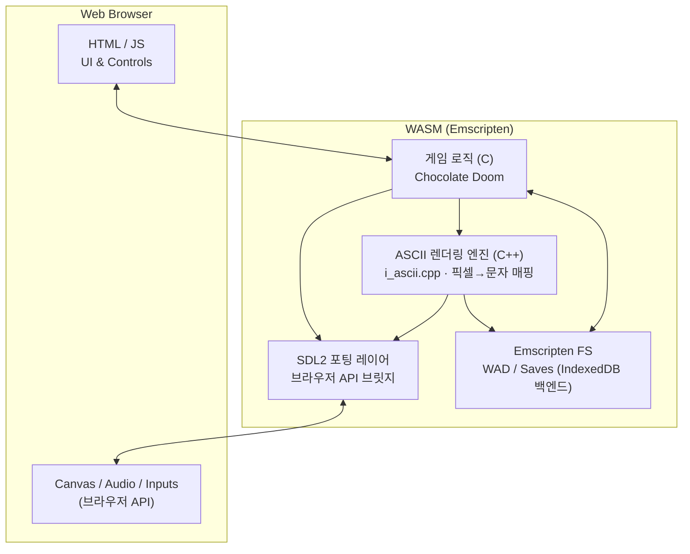

# ASCII Doom

[](https://github.com/devMinseok/ascii-doom/actions/workflows/deploy.yml)

Doom 게임을 웹에서 ASCII 아트로 즐길 수 있습니다.


## 🗂️ 프로젝트 정리

1. 팀 소개
   - 팀명: FC온라인
   - 팀장: 👑김철준   
   - 팀원: 강민석, 김문선

2. 프로젝트 개요 및 주요 기능  
   - Doom 렌더링을 ASCII 아트로 변환해 브라우저에서 플레이.  
   - 주요 기능: WebAssembly 기반 실행, SDL2 입출력 브릿지, 실시간 픽셀→ASCII 변환, WAD 로드 및 캐시, 키보드 입력 처리.

3. 실행 및 플레이 방법

   ⌨️ 조작키
   | 동작 | 키 |
   |------|-----|
   | 이동 | 방향키 (↑↓←→) |
   | 공격 | `A` |
   | 상호작용 | `S` |

    - 로컬 실행: [🔨 Build](#-build) 섹션 참고
    - GitHub Pages: https://devMinseok.github.io/ascii-doom/

4. 역할 분담  
   - 강민석: 전체 구조 설계  
   - 김문선: UI 설계  
   - 김철준: 아스키 그래픽 변환 로직 설계

5. 개발 중 어려웠던 점과 해결 방법  
   - 팔레트/감마: 원본 팔레트와 ASCII 밝기 스케일이 달라 어둡게 보임 → 감마 LUT(0.35)와 밝기→문자 LUT(idxLUT) 재조정.  
   - 해상도 스케일링: 셀 단위 다운샘플 시 계단/깨짐 → 적분영상 + 박스필터 평균으로 셀 컬러 추출.  
   - 메모리/성능: 프레임마다 동적 할당이 있어 힙 성장 → 프리할로케이션 버퍼(temp_r/g/b 등)와 역수 LUT로 나눗셈 제거.  
   - SIMD 호환: 일부 환경에서 SIMD 미지원 → JS 버튼으로 SIMD ON/OFF 토글, 벤치마크 패널에서 두 모드 모두 측정.

6. 가산점 항목으로 생각하는 부분
   - SIMD 최적화 시도: WASM SIMD로 픽셀 => 밝기 변환 루프를 벡터화, 16바이트 정렬 버퍼로 로드/스토어 정리.  
   - 병목: 문자 매핑 테이블 접근이 스칼라라서 이득이 제한됨.  
   - 결과: 7번 Latency 측정 테이블을 참고.

7. Latency 측정 테이블  
   | 시나리오 | 평균(ms) | P95(ms) | 환경/비고 |
   |----------|----------|---------|-----------|
   |          |          |         |           |
   |          |          |         |           |


## 🎮 특징

- 🌐 **브라우저에서 바로 실행**: 별도 설치 없이 웹 브라우저에서 바로 플레이
- 🎨 **ASCII 아트 렌더링**: 터미널 스타일의 고유한 비주얼 경험
- 📦 **WebAssembly 기반**: 네이티브에 가까운 성능으로 실행
- 🚀 **자동 배포**: GitHub Actions를 통한 CI/CD 파이프라인
- 🐳 **Docker 기반 빌드**: 일관된 빌드 환경 제공


## 🛠️ 기술 스택

### 핵심 기술

- **[Emscripten](https://emscripten.org/)**: C/C++ 코드를 WebAssembly와 JavaScript로 컴파일
- **[WebAssembly (WASM)](https://webassembly.org/)**: 고성능 바이너리 포맷으로 네이티브에 가까운 성능 제공
- **[SDL2](https://www.libsdl.org/)**: 크로스 플랫폼 멀티미디어 라이브러리 (입력, 오디오, 네트워킹)
- **[Chocolate Doom](https://www.chocolate-doom.org/)**: 정확한 Doom 소스 포트

### 빌드 도구

- **Autotools** (autoconf, automake): 빌드 시스템 자동화
- **Docker**: 일관된 빌드 환경 제공
- **GitHub Actions**: 자동 빌드 및 배포

### Emscripten 기능

- `ASYNCIFY`: 동기 C 코드를 비동기 JavaScript로 변환
- `ALLOW_MEMORY_GROWTH`: 동적 메모리 할당 지원
- `FORCE_FILESYSTEM`: Emscripten 가상 파일 시스템으로 WAD 파일 로드
- `USE_SDL=2`: SDL2 바인딩을 통한 브라우저 API 접근
- `EXPORTED_RUNTIME_METHODS`: JavaScript에서 WebAssembly 함수 호출을 위한 런타임 메서드 노출
- **WASM SIMD**: ASCII 렌더링 성능 최적화를 위한 SIMD 명령어 사용 (`i_ascii.cpp`)

## ⚙️ 동작 방식

### 빌드 프로세스

```text
C/C++ 소스 코드 (Chocolate Doom)
      ↓
Emscripten 컴파일러 (emcc)
      ↓
WebAssembly (.wasm) + JavaScript (.js) + HTML (.html)
      ↓
브라우저에서 실행
```

1. **소스 코드 컴파일**
   - Chocolate Doom의 C/C++ 소스 코드를 Emscripten으로 컴파일
   - SDL2를 브라우저 API로 변환 (Canvas, Web Audio API 등)
   - ASCII 렌더링을 위한 커스텀 구현 (`i_ascii.cpp`)

2. **WebAssembly 생성**
   - 게임 로직은 WebAssembly로 컴파일되어 고성능 실행
   - JavaScript는 WebAssembly와 브라우저 간 브릿지 역할

3. **파일 시스템**
   - Emscripten의 가상 파일 시스템을 통해 WAD 파일 로드
   - 브라우저의 IndexedDB를 백엔드로 사용

4. **렌더링**
   - ASCII 아트 렌더링 엔진이 게임 화면을 터미널 스타일로 변환
   - Canvas API를 통해 브라우저에 렌더링

### 아키텍처



### ASCII 그래픽 변환 흐름

```text
SDL Framebuffer (RGBA32) 입력
      ↓
`build_integral_images`: R/G/B 적분영상 생성 (누적합)
      ↓
셀 경계/카운트 계산: X0/X1/Y0/Y1/INV_COUNT
      ↓
패스1: 적분영상에서 RGB 평균 → `temp_r/g/b` (곱셈+시프트로 나눗셈 제거)
      ↓
패스2: 밝기 계산 (SIMD/스칼라) `Y=(r*299+g*587+b*114)>>10`
      ↓
감마 보정: `gamma_table` LUT (GAMMA=0.35)
      ↓
밝기→문자 매핑: `idxLUT` + `ASCII_CHARS[]`
      ↓
`AsciiCell{char,r,g,b}`에 기록
      ↓
JS가 HEAPU8 버퍼를 읽어 Canvas `fillText`로 렌더
```

## 📋 Prerequisites

**Docker Desktop만 설치하면 됩니다** (모든 플랫폼: macOS, Windows, Linux)

- [Docker Desktop 다운로드](https://www.docker.com/products/docker-desktop)
- Docker Compose는 Docker Desktop에 포함되어 있음

## 🔨 Build

### Dev Container 사용 (권장)

**VSCode:**

1. 프로젝트 열기
2. 명령 팔레트 (`Cmd+Shift+P` / `Ctrl+Shift+P`)
3. **"Dev Containers: Reopen in Container"** 선택
4. 컨테이너 빌드 완료 후 자동 연결

컨테이너 내부 터미널에서:

```bash
# 빌드 스크립트 실행
/usr/local/bin/build.sh
```

빌드된 파일은 `src/` 디렉토리에 생성됩니다:

**게임 실행 파일:**

- `chocolate-doom.html`, `chocolate-heretic.html`, `chocolate-hexen.html`, `chocolate-strife.html`
- 각각의 `.wasm` 및 `.js` 파일

**설정 및 서버 파일:**

- `chocolate-doom-setup.html`, `chocolate-heretic-setup.html`, `chocolate-hexen-setup.html`, `chocolate-strife-setup.html`
- `chocolate-setup.html` (공통 설정)
- `chocolate-server.html` (전용 서버)

### Docker Compose 사용 (대안)

Dev Container를 사용할 수 없는 경우:

```bash
# 이미지 빌드 (최초 1회)
docker-compose build

# 빌드 실행
docker-compose run --rm build /usr/local/bin/build.sh
```

## 🚀 Run

```bash
cd src
python3 -m http.server 8000
```

브라우저에서 `http://localhost:8000` 열기

## 📚 참고 자료

- [Chocolate Doom 공식 사이트](https://www.chocolate-doom.org/)
- [Emscripten 문서](https://emscripten.org/docs/getting_started/index.html)
- [WebAssembly 소개](https://webassembly.org/)
- [SDL2 문서](https://wiki.libsdl.org/)

## 📄 라이선스

이 프로젝트는 Chocolate Doom을 기반으로 하며, [GNU General Public License v2](COPYING.md)를 따릅니다.
